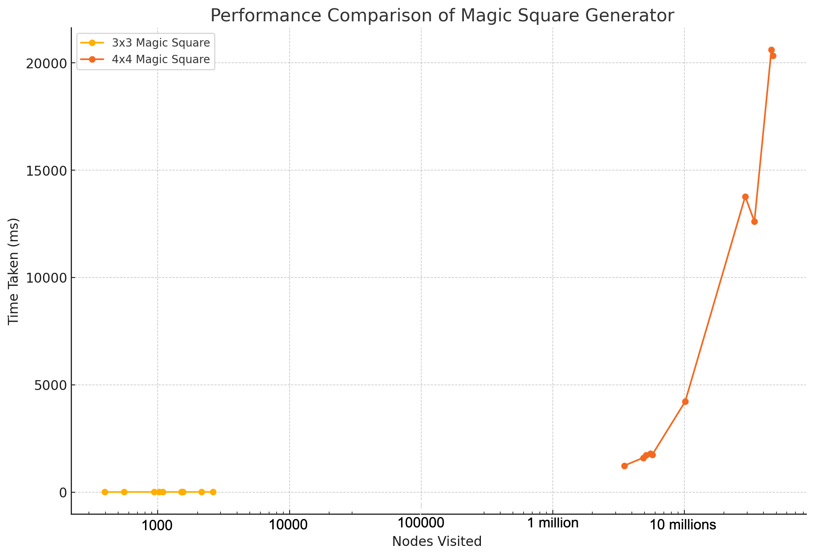

# Magic Square Generator

## About Magic Squares

Magic squares are a very ancient mathematical curiosity. They consist of a bidimensional array where every individual row, column and diagonal has a sum that is exactly the same. The array can only contain numbers from 1 to $n^2$, $n$ being the number of rows and columns. The magic sum can be calculated by the formula: $M=n(n^{2}+1)/2$. On the example below, since we have a 3x3 square, M is 15.

$M = 3(3^{2}+1)/2 = 3*10/2 = 15$

|     |     |     |
| --- | --- | --- |
| 8   | 3   | 4   |
| 1   | 5   | 9   |
| 6   | 7   | 2   |

If we use a brute force approach to generate magic squares, it's noticeable that is computationally expensive and the possibilities of squares grow exponentially with the dimensions. For 3x3, we have 9! possibilities, that is, 362880 different squares... A 4x4 square amounts to 16! possibilities, which is 20922789888000 (around 21 trillion). The number of possible magic squares for a given dimension also grows exponentially, as we can see from the table below:

| Dimension | Nº of squares | Nº of magic squares |
| --------- | ------------- | ------------------- |
| 3         | 9!            | 1                   |
| 4         | 16!           | 880                 |
| 5         | 25!           | 275305224           |

Obs: we don't count rotations and reflections as different squares, that's why a 3x3 square has only 1 possible magic square configuration.

## The project

The goal of this project is to treat the generation of magic squares as a [constraint satisfaction problem (CSP)](https://en.wikipedia.org/wiki/Constraint_satisfaction_problem). This is better than pure brute force because once you fill one position on the bidimensional array, we already exclude from consideration all the subsequent possibilities that are not compatible with a given constraint (in this case, obtaining the magic sum). There are two different implementations here: both use recursive backtracking, but one of them uses a forward checking technique and the other doesn't. Backtracking is a sort of refined brute force. At each node, we eliminate choices that are obviously not possible and proceed to recursively check only those that have potential. This way, at each depth of the tree, we mitigate the number of choices to consider in the future.


On the implementation without forward checking, we have a domain which is the unassigned numbers. Before assigning a number, we check if that assignment is compatible with the constraints (if it doesn't result on a row, column or diagonal sum bigger than the magic sum). Forward checking in this case would mean having for each position of the square a different domain, that is updated every time a new number is assigned to the square. So, forward checking implies reducing considerably the number of visited nodes, since we exclude from the domain of each cell those numbers that are not compatible with our constraints. You can check the details of each implementation on the `recursive-backtracking/Main.java` and `forward-checking/Main.java` files of this project.

## How to run the project

1. Go to the folder of the implementation you wish to test, that is, either `recursive-backtracking`or `forward-checking`.
2. Compile the program:

```
javac Main.java
```

3. Run the program specifying as argument the dimension of the square. For instance, for 3x3 squares, execute:

```
java Main 3
```

## Benchmarking

There are certainly more efficient ways of generating magic squares. The purpose of this project however was to solve this problem as a CSP applying a backtracking algorithm. I've implemented the algorithm in a way that it always choose a random empty cell of the square to fill, and proceeds given that this action conforms to the constraints of the problem. That means that at every execution the program follows a different recursion path, so it's execution will vary in time and in number of visited nodes.

### Without forward checking

On the table below you can check how the algorithm without forward checking behaved for 3x3 and 4x4 magic squares in 10 different attempts. I've sorted the data in ascending order considering the number of nodes visited (equivalent to the number of times the recursive backtracking function is called).

| Attempt | 3x3 Nodes Visited | 3x3 Time Taken (ms) | 4x4 Nodes Visited | 4x4 Time Taken (ms) |
| ------- | ----------------- | ------------------- | ----------------- | ------------------- |
| 1       | 394               | 5                   | 3,500,156         | 1,234               |
| 2       | 554               | 6                   | 4,867,672         | 1,600               |
| 3       | 936               | 6                   | 5,111,494         | 1,722               |
| 4       | 1,028             | 7                   | 5,522,682         | 1,803               |
| 5       | 1,087             | 7                   | 5,706,364         | 1,739               |
| 6       | 1,513             | 7                   | 10,152,537        | 4,218               |
| 7       | 1,520             | 8                   | 15,243,314        | 6,466               |
| 8       | 1,553             | 7                   | 29,042,001        | 13,777              |
| 9       | 2,143             | 7                   | 34,114,131        | 12,611              |
| 10      | 2,621             | 8                   | 45,909,711        | 20,609              |



### With forward checking

| Attempt | 3x3 Nodes Visited | 3x3 Time Taken (ms) | 4x4 Nodes Visited | 4x4 Time Taken (ms) |
| ------- | ----------------- | ------------------- | ----------------- | ------------------- |
| 1       | 17                | 4                   | 134,380           | 566                 |
| 2       | 70                | 7                   | 295,730           | 1,202               |
| 3       | 82                | 7                   | 851,702           | 2,774               |
| 4       | 85                | 7                   | 1,455,105         | 6,001               |
| 5       | 326               | 10                  | 1,524,314         | 6,466               |
| 6       | 372               | 10                  | 1,668,323         | 7,348               |
| 7       | 461               | 11                  | 3,491,014         | 15,854              |
| 8       | 545               | 12                  | 3,712,188         | 16,197              |
| 9       | 621               | 12                  | 6,324,154         | 22,841              |
| 10      | 1,046             | 14                  | 7,076,191         | 28,206              |


### Comparison Recursive Backtracking `With x Without` Forward Checking (3x3 squares).

| Attempt | Without FC: Nodes | Without FC: Time (ms) | With FC: Nodes | With FC: Time (ms) |
| ------- | ----------------- | --------------------- | -------------- | ------------------ |
| 1       | 394               | 5                     | 17             | 4                  |
| 2       | 554               | 6                     | 70             | 7                  |
| 3       | 936               | 6                     | 82             | 7                  |
| 4       | 1,028             | 7                     | 85             | 7                  |
| 5       | 1,087             | 7                     | 326            | 10                 |
| 6       | 1,513             | 7                     | 372            | 10                 |
| 7       | 1,520             | 8                     | 461            | 11                 |
| 8       | 1,553             | 7                     | 545            | 12                 |
| 9       | 2,143             | 7                     | 621            | 12                 |
| 10      | 2,621             | 8                     | 1,046          | 14                 |


### Comparison Recursive Backtracking `With x Without` Forward Checking (4x4 squares).

| Attempt | Without FC: Nodes | Without FC: Time (ms) | With FC: Nodes | With FC: Time (ms) |
| ------- | ----------------- | --------------------- | -------------- | ------------------ |
| 1       | 3,500,156         | 1,234                 | 134,380        | 566                |
| 2       | 4,867,672         | 1,600                 | 295,730        | 1,202              |
| 3       | 5,111,494         | 1,722                 | 851,702        | 2,774              |
| 4       | 5,522,682         | 1,803                 | 1,455,105      | 6,001              |
| 5       | 5,706,364         | 1,739                 | 1,524,314      | 6,466              |
| 6       | 10,152,537        | 4,218                 | 1,668,323      | 7,348              |
| 7       | 15,243,314        | 6,466                 | 3,491,014      | 15,854             |
| 8       | 29,042,001        | 13,777                | 3,712,188      | 16,197             |
| 9       | 34,114,131        | 12,611                | 6,324,154      | 22,841             |
| 10      | 45,909,711        | 20,609                | 7,076,191      | 28,206             |


## Conclusion

### Pros of forward checking

Forward checking significantly reduces the search space by preemptively eliminating potential values that do not satisfy the constraints before they are even tried in the square. This is evident from the statistics showing a drastic reduction in the number of nodes visited for many of the runs with forward checking compared to those without. This method helps avoid deep recursion paths that do not lead to a solution, which is particularly advantageous in larger 4x4 squares where the complexity and possibilities increase exponentially.

### Cons of forward checking

Despite the reduction in nodes visited, forward checking involves additional computational overhead due to the need to manage and update domains—sets of possible values that can occupy specific cells based on current partial solutions. The code must handle the creation of deep copies of domains for each recursive call, and it must consistently update these domains whenever a value is placed in a magic square. This can result in increased computation times, as seen in some instances where the time taken with forward checking was higher than without, despite fewer nodes being visited.
